# ERD — Anglo Mining Fuel DW (schema `dw`, AngloData_QA_20220825_1820)

```mermaid
erDiagram
    DimDate ||--o{ FactFuelTransaction : DateKey
    DimDate ||--o{ FactFuelDelivery : DateKey
    DimDate ||--o{ FactMeterReading : DateKey
    DimDate ||--o{ FactEquipmentTrip : "SourceDateKey / DestinationDateKey"
    DimDate ||--o{ FactLocationVolume : DateKey
    DimDate ||--o{ FactStorageLogbook : DateKey
    DimDate ||--o{ FactFuelUsageClassification : DateKey
    DimDate ||--o{ FactDieselRefundClaim : ClaimPeriodDateKey

    DimEquipment ||--o{ FactFuelTransaction : EquipmentKey
    DimEquipment ||--o{ FactMeterReading : EquipmentKey
    DimEquipment ||--o{ FactEquipmentTrip : EquipmentKey
    DimEquipment ||--o{ FactStorageLogbook : EquipmentKey
    DimEquipment ||--o{ FactFuelUsageClassification : EquipmentKey
    DimEligibleActivity ||--o{ DimEquipment : EligibleActivityKey

    DimLocation ||--o{ FactFuelTransaction : LocationKey
    DimLocation ||--o{ FactFuelDelivery : LocationKey
    DimLocation ||--o{ FactLocationVolume : LocationKey
    DimLocation ||--o{ FactStorageLogbook : LocationKey

    DimProduct ||--o{ FactFuelTransaction : ProductKey
    DimProduct ||--o{ FactFuelDelivery : ProductKey

    DimCostCentre ||--o{ FactFuelTransaction : CostCentreKey
    DimEligibleActivity ||--o{ FactFuelTransaction : EligibleActivityKey

    DimSARSUsageType ||--o{ DimRefundRate : SARSUsageTypeKey
    DimSARSUsageType ||--o{ FactDieselRefundClaim : SARSUsageTypeKey
    DimRefundRate ||--o{ FactDieselRefundClaim : RefundRateKey

    DimDate {
        int DateKey PK
        date FullDate
        varchar FiscalYearSA
        varchar SeasonSouthernAfrica
    }
    DimEquipment {
        int EquipmentKey PK
        nvarchar FleetId
        nvarchar RegNumber
        nvarchar MakeName
        nvarchar ModelName
        nvarchar VehicleTypeName
        nvarchar ConsumptionTypeName
        float TankSize
        varchar EligibilityClass
    }
    DimCostCentre {
        int CostCentreKey PK
        varchar CostCentreName
        varchar TaxRebateCode
        varchar GlAccount
    }
    DimEligibleActivity {
        int EligibleActivityKey PK
        varchar ActivityCodePattern
        varchar EligibilityStatus
    }
    DimSARSUsageType {
        int SARSUsageTypeKey PK
        varchar UsageTypeName
        decimal QualifyingPercentage
        decimal RateChangeFactor
    }
    DimRefundRate {
        int RefundRateKey PK
        date EffectiveFromDate
        decimal RefundRateCentsPerLitre
    }
    FactFuelTransaction {
        bigint FuelTransactionKey PK
        float Litres
        int FuelEventId "degenerate"
        nvarchar VoucherNumber "degenerate"
    }
    FactFuelUsageClassification {
        bigint UsageClassificationKey PK
        float TotalFuelUsedLitres
        float NonEligibleLitres
        float EligibleUsageLitres "computed persisted"
    }
    FactDieselRefundClaim {
        int DieselRefundClaimKey PK
        decimal EligibleLitres
        decimal QualifyingClaimLitres "eligible x 80 pct"
        decimal RefundAmountRand
    }
```

Row counts (built 2026-07-06, all reconciled 1:1 to source):

| Table | Rows | Source |
|---|---|---|
| DimDate | 5,478 | generated calendar 2009–2023 |
| DimEquipment | 2,256 | lstEquipment + make/model/type lookups |
| DimLocation | 28 | lstLocation |
| DimProduct | 10 | lstProduct |
| DimCostCentre | 492 | distinct of CostCentre extract |
| DimEligibleActivity | 11 | seeded from fn_GetStorageReportLive logic |
| DimSARSUsageType | 4 | seeded from SARS policy evidence |
| DimRefundRate | 8 | seeded from SARS policy evidence (2020 examples) |
| FactFuelTransaction | 325,504 | datAFSRecord (290,557,288.29 L — exact match) |
| FactFuelDelivery | 2,153 | datFuelDelivery (83,566,650.10 L — exact match) |
| FactMeterReading | 139,123 | datMeterReading |
| FactEquipmentTrip | 778,254 | datTripRecord |
| FactLocationVolume | 27,293 | datLocationVolumeReading |
| FactStorageLogbook | 295,509 | cacheStorageLogbook |
| FactFuelUsageClassification | 282,793 | cacheUsageLogbook |
| FactDieselRefundClaim | 44 | monthly SARS 670.04 calc over usage fact |
